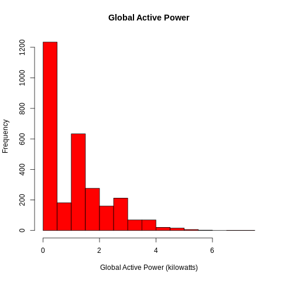
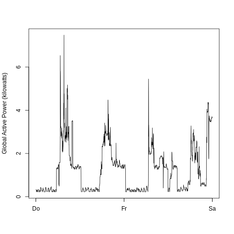
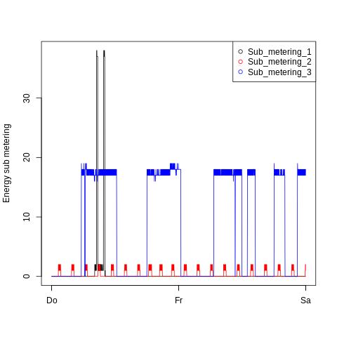
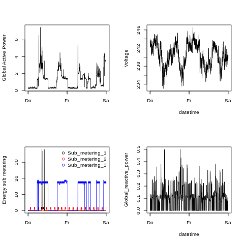

# Data Visualization with R

This folder uses R programming language for simple data visualization. The data is taken from the <a href="http://archive.ics.uci.edu/ml/">UC Irvine Machine Learning Repository</a>, a popular repository for machine learning datasets. In particular, dataset "Individual household electric power consumption" is chosen.

### Dataset:
<a href="https://d396qusza40orc.cloudfront.net/exdata%2Fdata%2Fhousehold_power_consumption.zip">Electric power consumption</a> [20Mb]

This data is the measurement of electric power consumption in one household with a one-minute sampling rate over a period of almost 4 years. Different electrical quantities and some sub-metering values are available. The dataset has 2,075,259 rows and 9 columns. Note that in this dataset missing values are coded as `?`.
The following descriptions of the 9 variables in the dataset are taken from the <a href="https://archive.ics.uci.edu/ml/datasets/Individual+household+electric+power+consumption">UCI
web site</a>:

<ol>
<li><b>Date</b>: Date in format dd/mm/yyyy </li>
<li><b>Time</b>: time in format hh:mm:ss </li>
<li><b>Global_active_power</b>: household global minute-averaged active power (in kilowatt) </li>
<li><b>Global_reactive_power</b>: household global minute-averaged reactive power (in kilowatt) </li>
<li><b>Voltage</b>: minute-averaged voltage (in volt) </li>
<li><b>Global_intensity</b>: household global minute-averaged current intensity (in ampere) </li>
<li><b>Sub_metering_1</b>: energy sub-metering No. 1 (in watt-hour of active energy). It corresponds to the kitchen, containing mainly a dishwasher, an oven and a microwave (hot plates are not electric but gas powered). </li>
<li><b>Sub_metering_2</b>: energy sub-metering No. 2 (in watt-hour of active energy). It corresponds to the laundry room, containing a washing-machine, a tumble-drier, a refrigerator and a light. </li>
<li><b>Sub_metering_3</b>: energy sub-metering No. 3 (in watt-hour of active energy). It corresponds to an electric water-heater and an air-conditioner.</li>
</ol>

### Procedure:
1. Since the dataset is huge, consider the data only during the 2 day period in February (1.2.2007 - 2.2.2007).
2. Examine how the household energy usage varies over this 2 day period! 

### Result:

  

  

  

